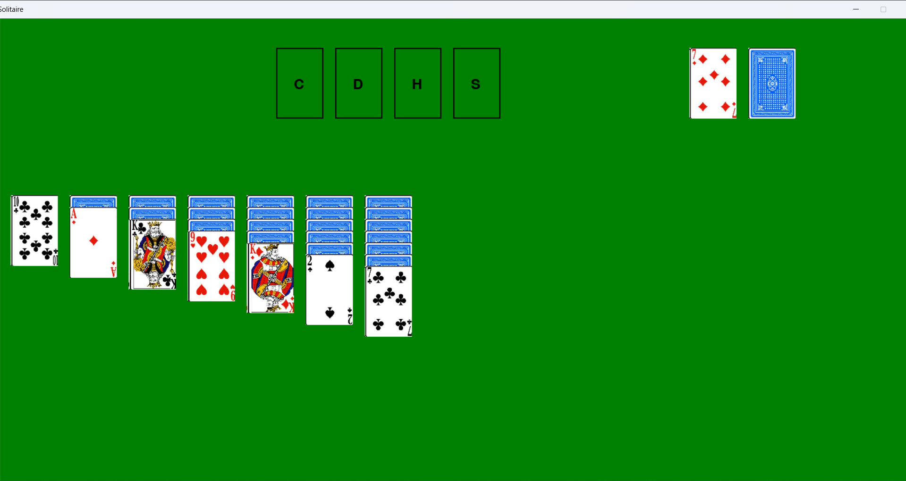
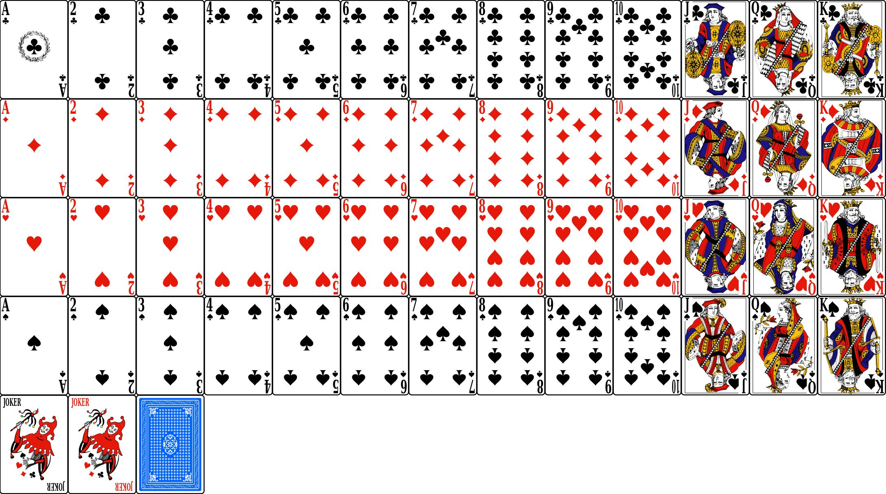
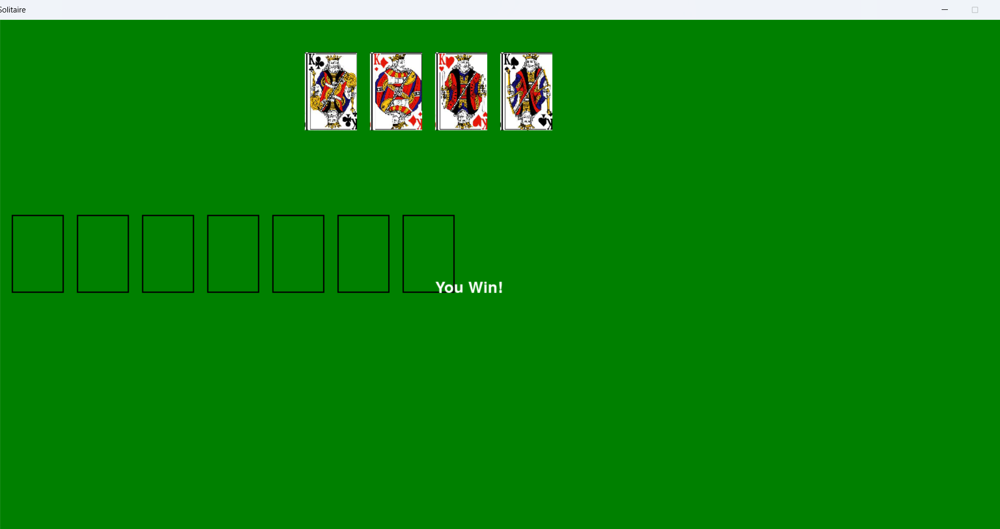

# GAME OF SOLITAIRE

## Description
This project is a minimalistic graphical interface that allows users to play the classic game of Solitaire. It is designed to provide a simple yet engaging experience by displaying cards and offering basic functionalities required to play the game. Upon completion of the game, a corresponding message will be displayed to the user.

---

## Project Details
- **Name:** GAME OF SOLITAIRE
- **ID:** 20
- **Difficulty:** A 
- **Proposed:** ALM
- **Made by:** Hutan Stefan


---

## Features
1. Minimal graphical interface for gameplay.

2. Dynamic card display.

3. Endgame message display based on the outcome of the game.


---

## Input
The program requires the following file:
- **`solitaire.py`**: The main Python file containing the code to launch and run the Solitaire game.

---

## Output
- A graphical interface displaying the cards for the game.
- At the end of the game, a corresponding message is shown to indicate the outcome (e.g., win).

---

## How to Run
1. Ensure you have Python installed on your machine.
2. Run the main script:
   ```bash
   python solitaire.py
   ```
3. The graphical interface will launch, allowing you to start playing.

---

## Requirements
- Python 3.x
- GUI libraries such as `pygame` (ensure they are installed if required by the project).

---

## How to Play
1. Launch the game by running the script.
2. Interact with the cards using your mouse.
3. Arrange the cards in accordance with the rules of Solitaire.
4. Once the game is completed, the system will display a message indicating your result.

---

## Notes
- This project is designed for educational purposes and can be extended with additional features such as score tracking, timer, or advanced graphical enhancements.

---

## Contact
For further inquiries or contributions, contact the project maintainer via email at `sh@cloudlab-solutions.com`.

Enjoy playing the GAME OF SOLITAIRE!

